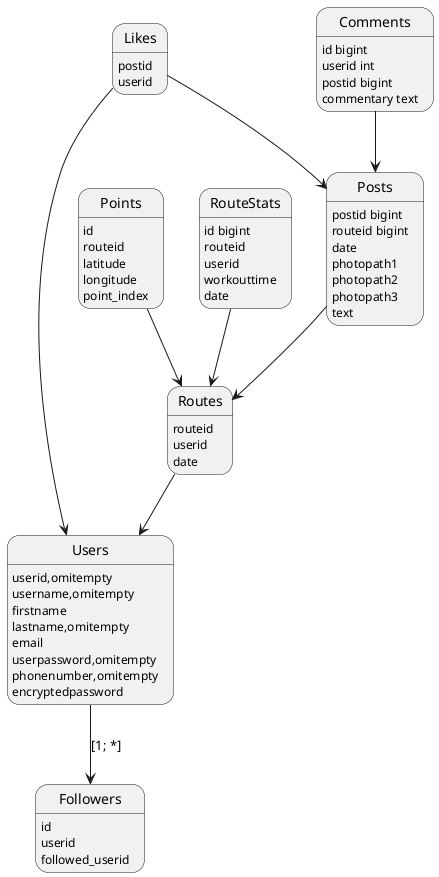

## User
> From FRONT
```json
{
	"username": "might be empty",
	"firstname": "not empty",
	"lastname": "might be empy",
	"email": "not empty",
	"userpassword": "not empty",
	"phonenumber": "might be empty",
}
```
>From BACK
```json
{
	"userid": "not empty",
	"username": "might be empty",
	"firstname": "not empty",
	"lastname": "might be empy",
	"email": "not empty",
	"phonenumber": "might be empty",
}
```
### Methods
> Method | input | output | cookie | type
> --|--|--|--|--
> user/create | email, password, firstname | user json and session cookie | - | post
> user/create | email, password, firstname | redirect to home page and send user json | + | post
>user/update | user json | error | - | update
>user/update | user json | user json | + | update
>user/delete | - | error | - | delete
>user/delete | - | deletes cookie | + | delete
> ---
### Additional to user
> Method | input | output | cookie | type
> --|--|--|--|--
> /login |  email, password | user json and session cookie | - | post
> /login |  email, password | error | + | post
> /logout | - | error | - | GET
> /logout | - | - | + | GET

- logout требует только куку
- login требует пароль и эмеил
- user/update работает с кукой и меняет всё кроме юзерид
- обязательное поле firstname, email, password в createuser
- метод createuser перенаправляет в home, если есть сессионная кука


